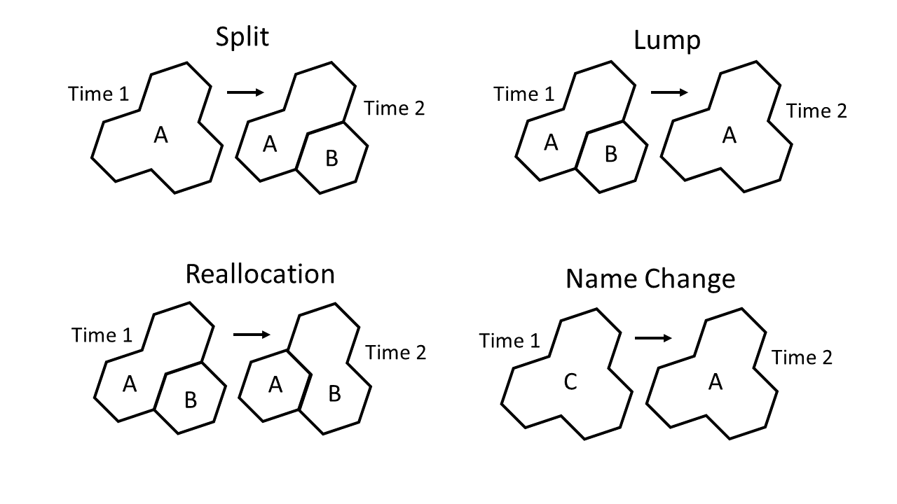
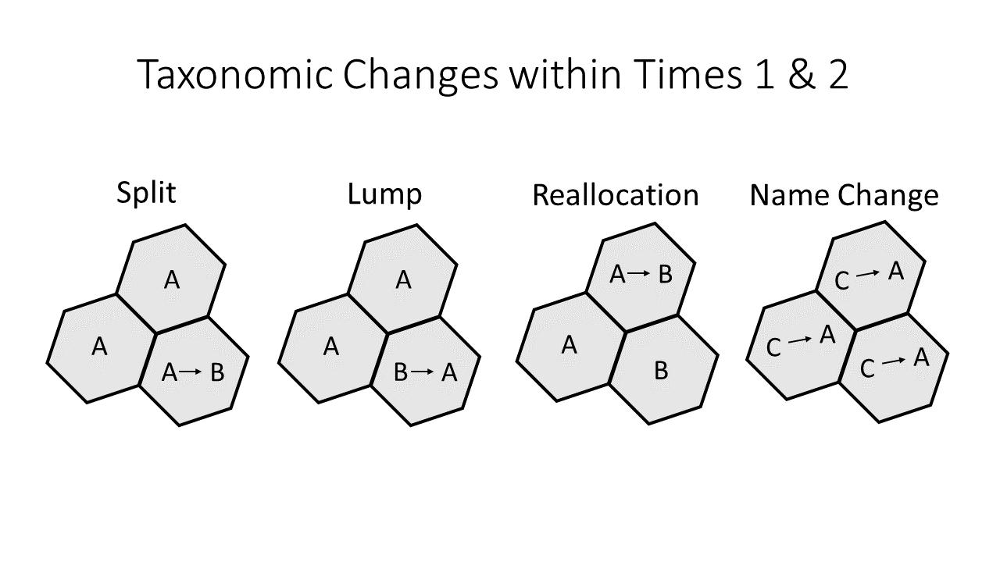
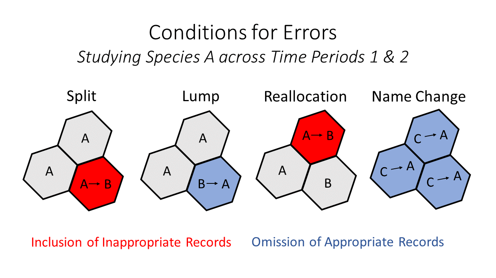
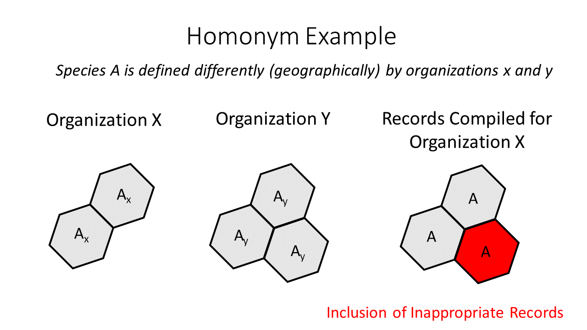

## Installation
1.  Use [Git](https://git-scm.com/) to clone the master repo from github to your computer.
2.  Build a [Conda](https://docs.conda.io/projects/conda/en/latest/index.html) environment. Running the following code in a conda shell
    should create a suitable environment named "wrangler":
    a. "conda create -n wrangler python=3.6 pandas jupyter basemap-data-hires notebook numpy shapely"
    b. "conda activate wrangler"
    c. "pip install pygbif python-dwca-reader sciencebasepy"
3.  Install [Spatialite](https://www.gaia-gis.it/fossil/libspatialite/index).  Spatialite is a spatial extension for [SQLite](https://www.sqlite.org/index.html).  
    SQLite is included in Python, but not the spatialite extension.  See the included file "spatialite PC install notes.txt" for more instructions.
4.  Copy the wildlife-wrangler_TEMPLATE.sqlite file to your computer, and
    delete "TEMPLATE" from the copied file's name ("wildlife-wrangler.sqlite").
5.  Copy the wranglerconfig_TEMPLATE.txt file to your computer and delete
    "TEMPLATE" from the copied file's name ("wranglerconfig.txt").  Fill out
    this file.  Be sure to create a folders named "Input" and "Output"
    within your designated working directory ("workDir").  Use "/" at the
    end of paths (i.e. "C:/Data/").
6.  Set up an account on GBIF.org and enter your credentials into
    your copy of wranglerconfig.txt.
7.  Download [DB Browser for SQLite](https://sqlitebrowser.org/) or
    another application for interacting with SQLite database.
8.  Run one of the notebook documents in the "Tests" folder.

## Using the Wildlife Wrangler
The Wildlife Wrangler is a set of tools to facilitate queries and filtering of
species occurrence records.  While it automates many tasks, there is still
a bit of work that must be done by the user.

#### General Overview of the Workflow
The user enters species information and unique sets of filtering parameters in their copy of wildlife-wrangler.sqlite, then fills out a small portion of a
[Jupyter Notebook](https://jupyter.org/) document with codes for a species definition and filter parameters sets to use and relevant directories.  When the notebook document is
run, code that is stored in "wrangler_functions.py" and the notebook document itself retrieves records from GBIF, filters out unsuitable records, creates an output database where suitable records are stored along with documentation and summaries of record attributes before and after filtering, and performs various summaries of data attributes within the notebook document.  Thus, the primary results of running the wrangler are 1) the notebook document with documentation and data summaries and 2) the output (SQLite) database containing suitable records.  

#### Key Components of the Framework
*  __wildlife-wrangler.sqlite__ -- a centralized place to store filtering
   criteria and species definitions.  Saving filter sets (criteria) and species definitions as unique items in a database makes it much easier to explore
   combinations of species definitions and filtering criteria.  For example, if you want to use the same criteria for 20 species, you can call the same criteria each of the 20 times with just the codes.  This setup was chosen with the running of hundreds of queries over time in mind.
*  __report.ipynb__ -- this is where you control/run the wrangler.  It's kind of like a beefed-up form and report all in one.  Once you have species definitions and filter sets entered into wildlife-wrangler.sqlite, you can copy report notebook documents to create and run occurrence record queries/requests/downloads.
*  __wranglerconfig__ -- this is a text file where you store some personal
   information that you wouldn't want saved in the notebook document: your email
   address and password for your GBIF account, which is needed in order to
   requests large downloads from GBIF.
*  __wrangler_functions.py__ -- a python module containing the meat and
   and potatoes functions of the wrangler.  DO NOT CHANGE!  Much of the necessary code is kept here to avoid having a thousand lines of code in the report.ipynb.  You can call some functions from this by importing the module in ipython (i.e., "import wrangler_functions as wranglers").  That
   can be handy for using the "getGBIFcode" function.

#### Detailed Instructions
1.  Open your copy of "__widlife-wrangler.sqlite__".  
2.  In the "__species_concepts__" table, enter in a species definition by entering a unique species code of your choosing in "species_id", the
    corresponding gbif species id in "gbif_id", "common_name", and "scientific_name".  GBIF species id codes can be retrieved from their website, or with the "getGBIFcode" function available in wildlife_functions.py.  Finally, enter an estimate of the maximum distance from an observer at which a species
    could be detected with common surveying methods in "detection_distance_meters".  For example, a shrew should have a value close to 0, whereas a wren should have a value closer to 100 m.  All other fields in this table may be helpful, but are not required.  
3.  In the "__gbif_requests__" table, enter a unique code for your filter set in "request_id".  Fill out each field, but note many fields have defaults.    These will be criteria for a first stage of filtering: only records meeting these criteria will be requested from the API.
4.  In the "__gbif_filters__" table, enter a unique code for your post-request filter set in "fiter_id". Fill out all other fields but note that defaults are present for some fields.  
5.  Copy "__report_TEMPLATE.ipynb__" to a location outside of the wrangler repo, say to your project directory.  Rename the notebook document to whatever you like.  Using a name with the species code request_id, and filter_id is helpful.
6.  In conda, activate your wrangler environment.  Open Jupyter Notebook
    and navigate to your renamed copy of "report_TEMPLATE.ipynb".  Fill out
    the first two cells of the notebook document and run it.  Run time can range from
    a few seconds to several hours.
7.  When you have completed a query/notebook document, you can export the notebook document as
    an html file and archive it for reference later.  

#### Where to Find Help
*  Within "wildlife-wrangler.sqlite", all tables and columns are explained
   in the "table_definitions" and "column_definitions" tables.  Example
   entries are included for "species_concepts", "gbif_requests", and "gbif_filters".
*  Example report notebook documents are provided in the examples folder.
*  The wrangler uses the [pygbif](https://pygbif.readthedocs.io/en/latest/)
   package, so its documentation can help explain the request step.
   These are the GBIF fields currently used to answer key questions about records:
   * What? -- "id", "gbifID", "individualCount", "identificationQualifier"

   * When? -- "eventDate", "retrievalDate"

   * Where? -- "coordinateUncertaintyInMeters", "decimalLatitude", "decimalLongitude", "footprintWKT", "geodeticDatum"

   * Who provided? -- "collectionCode", "institutionCode", "datasetName"

   * How obtained? -- "basisOfRecord", "samplingProtocol", "establishmentMeans",

   * Issues, notes, comments -- "issue" or "issues", "locality", "eventRemarks", "locationRemarks", "occurrenceRemarks"

## Important Considerations

#### Taxonomic issues
Species are uniquely defined with taxon concepts, which are combinations of name, rank, and other characteristics, possibly including geographic distributions.  These concepts are occasionally revised and sometimes create changes to scientific names and/or the underlying concepts.  Additionally, concepts are not universally accepted by individuals and institutions, including data providers.  Taxonomy can pose a challenge for efforts to use species occurrence records in spatial analyses because we often approach the data with software and data infrastructures that rely on links between occurrence records and species concepts that may be incomplete or imperfect.

When we query species occurrence record databases, we retrieve georeferenced records of the existence of individual organisms on the basis of an attributed scientific name and/or associated species code.  "Species identification" is the assignment of the individual to a species.  Unfortunately, when names change during taxonomic revisions, appropriate records from a range of dates may then become recorded under multiple names.  Furthermore, the geographic distributions of species have rarely been explicit stated in sufficient detail when concepts were formalized and beliefs about distributions may also change during taxonomic revisions, even when scientific names do not.  If the distributions of taxon concepts are not explicit, then the species names attributed to georeferenced occurrence records from the past cannot be updated accordingly.  Thus, records selected with valid names may be inappropriate and erroneous because they are georeferenced to locations outside of the valid distribution of the concept.

It may not be immediately apparent that it is possible for correctly georeferenced occurrence records to exist outside of a valid range.  After all, don't the species' known locations ultimately reflect the true distribution and thus define the valid range?  The answer depends on the species.  Within a particular region of study, some species may have morphology or behaviors that are so unique as to allow little room for misidentification as a related species during a given sampling protocol.  In those cases, the records are reliable indicators of distributions.  However, in other cases, it can be difficult to distinguish a species from another that is closely related and geographically adjacent.  When that is the case, beliefs about species' range boundaries may contribute to the identification of an observed individual.  This is often the case with records that are derived from birdwatchers.  Failure to revise the species names that are attributed to occurrence records according to changes over time in the accepted beliefs about the spatial distributions of the similar and related species generates misidentifications retroactively.     

It is important to be aware of three problematic situations that can arise due to taxonomic changes when using species occurrence records.  One, changes with geographic components may have occurred, such as lumps or splits that altered the distributions associated with each taxon's concept, or similarly, areas may have been reallocated among taxon concepts while names remained unchanged ("range reallocation").  Such changes will be cryptic when distributions are not explicit.  Two, links between taxonomic synonyms may be unavailable.  In some cases, accepted names can differ across data providers or institutions, as well as over time (i.e. over taxonomic revisions) even though how the taxa are circumscribed, including geographically, are identical.  Three, names may match when the concepts do not, which is termed "homonymy".  

Lumps, splits, range reallocations, and name changes are illustrated below.  The figure illustrates lumps, splits, and reallocations independently, but note that a single taxonomic revision could create instances of each for a single taxon.  For example, the accepted range of a species could simultaneously be reduced in some areas due to splits or reallocations while be added to others via lumps or reallocations.

The changes illustrated above can also be illustrated for a range of dates within spatial units (hex grid cells) to show where taxonomic changes occurred during a time period.

Errors can be introduced into range delineation or evaluation efforts when users fail to account for all the taxon concepts that were involved in taxonomic revisions within a study’s geographic extent or fail to account for the geographic ranges implicit in taxon concepts when matching them by scientific or common names (cross-referencing).  Those errors can lead to the inclusion of inappropriate records and the omission of appropriate records. The inclusion of inappropriate records can introduce commission errors into range maps and create false omission errors and inflated omission rates during map evaluations.  The omission of appropriate records is less problematic as it opens the door for avoidable omission errors in range maps and missed opportunities for validation.  The illustration below shows the conditions when each of those errors can occur.

Homonymy is also capable of generating conditions for the inclusion of inappropriate records, and thus, commission errors in range maps and false omission errors during map evaluations.

Without strategies for dealing with these potential errors, model quality can be hindered to an unknown degree.  Because the valid geographies of taxon concepts have not been detailed explicitly, users are left to assess whether the errors could affect their work and how to address them when deemed necessary.  Some species may have morphology or behaviors that are so unique as to allow little room for error. Conversely, it can be very difficult to distinguish many species from those that are closely related and geographically adjacent or overlapping.  

I have identified several strategies for dealing with the potential errors described above.  One, conduct taxonomically broad investigations of taxon concepts.  Perfect avoidance of errors would demand accounting for all taxon concepts that were involved in taxonomic revisions, not just a focal species.  Two, avoid matching taxon concepts with names alone.  Instead, match the concepts and assign concepts unique identifiers.  Exhaustively assess whether taxon concepts, especially geographies, match. Three, make geographies explicit by storing geometries with taxon concepts.  Four, make the life spans of concepts explicit by including the start and end dates/years of the time span when concepts were valid.  Five, cross-reference concepts across institutions, and document concept lineages.  Was the concept created out of revision of another concept?  If the concept was invalidated by a revision, what valid concepts resulted?  The wildlife wrangler offers a way to accommodate these strategies by including a table for taxon concepts in the wildlife-wrangler.sqlite with columns for storing this information, but note that this information is not currently utilized in processes for record acquisition or filtering.  Users must ultimately use the strategies to organize taxon concepts of interest and determine which are relevant for their time periods of interest.
